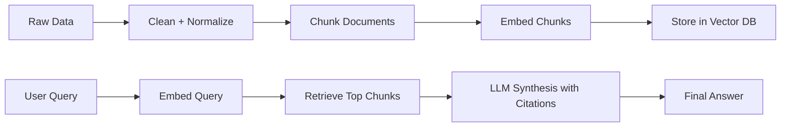
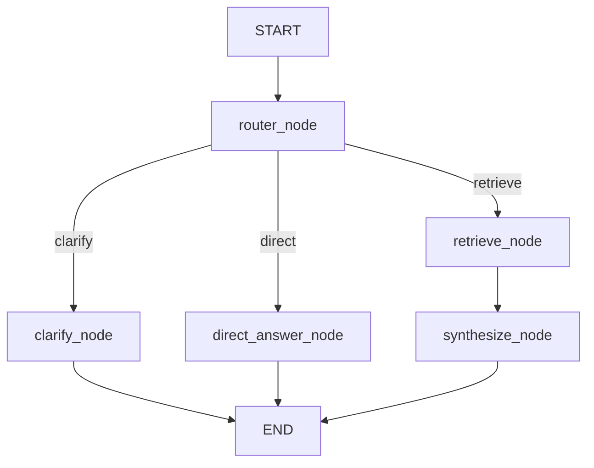

# LEARN.md

This document teaches you RAG like a mentor would, using this codebase as the concrete example.

You will learn three things:
1. What has been built in this repo.
2. Why each piece exists.
3. How to build your own RAG system by adapting this design.

## 1) What You Built Here

This repo is an **agentic RAG system** over earnings-call data.

Core stack used in this project:
- LangChain
- LangGraph
- LangSmith
- Pinecone
- Groq (LLM provider)
- HuggingFace dataset `lamini/earnings-calls-qa`

Core runtime paths:
- Ingestion and normalization
- Chunking with two strategies
- Vector indexing in Pinecone
- Retrieval + citation-grounded synthesis
- Agentic routing (`retrieve`, `clarify`, `direct`)
- Streamlit UI
- Evaluation and experiment comparison

## 2) Mental Model: RAG in One Page

RAG is not one step. It is a pipeline:



This repo adds an agent layer before retrieval:
- If query is ambiguous: ask clarification first.
- If query is conceptual/general: answer directly.
- If query needs evidence: retrieve then synthesize.

That decision policy is implemented in LangGraph.

## 3) Codebase Tour: What, Why, How

### 3.1 Configuration and fail-fast behavior

Files:
- `src/config.py`
- `.env.example`

What:
- Centralized settings via `pydantic-settings`.
- Explicit env validation with `validate_env()`.

Why:
- Prevent silent failures.
- Keep local development easy while still enforcing required keys when specific workflows run.

How:
- `Settings` defines all knobs (`GROQ_*`, `PINECONE_*`, `LANGSMITH_*`, debug flags).
- `validate_env([...])` is called in provider-specific modules before network calls.

### 3.2 Dataset ingestion and normalization

Files:
- `src/data/hf_loader.py`
- `src/data/cleaners.py`
- `src/utils/ids.py`

What:
- Loads HuggingFace dataset `lamini/earnings-calls-qa`.
- Canonicalizes fields into one stable schema.
- Generates stable IDs.

Why:
- Upstream datasets can have inconsistent field names.
- Stable IDs prevent duplicate vectors across re-indexing.
- Clean text improves chunking and retrieval quality.

How:
- `load_records(mode, limit)` supports `small` and `full`.
- Canonical record shape:
  - `question`
  - `answer`
  - `text`
  - `doc_id`
  - `metadata`
- If HF loading fails, code falls back to tiny local sample so the pipeline still runs for development.

### 3.3 Document conversion and chunking

Files:
- `src/data/doc_builder.py`
- `src/data/chunking.py`

What:
- Converts canonical records into LangChain-like `Document`s.
- Implements two chunking strategies:
  - `baseline` recursive chunking
  - `structure_aware` heuristic chunking by speaker/Q&A markers

Why:
- Chunk boundaries matter for retrieval quality.
- Baseline gives robust default behavior.
- Structure-aware splits preserve transcript semantics better in many earnings-call scenarios.

How:
- Both chunkers attach metadata:
  - `chunk_id`
  - `chunk_index`
  - `split`
  - `section`
- Overlap is preserved to reduce answer breaks across chunk boundaries.

### 3.4 Embeddings and Pinecone indexing

Files:
- `src/indexing/embedder.py`
- `src/indexing/pinecone_client.py`
- `src/indexing/indexer.py`
- `src/indexing/cli_index.py`

What:
- Embeds chunks and upserts vectors to Pinecone.
- Creates Pinecone index automatically when missing.

Why:
- Embedding model dimension must match index dimension.
- Programmatic index creation improves reproducibility for local setup.

How:
- Embedding strategy:
  - Primary: HuggingFace embeddings
  - Fallback: deterministic local hash embeddings (for offline/dev continuity)
- Pinecone client:
  - Validates env vars
  - Creates index if absent
  - Checks dimension compatibility if index exists
- Upsert IDs are stable: `doc_id:chunk_id`

Run indexing:
```bash
python -m src.indexing.cli_index --mode small --limit 200 --strategy baseline
```

### 3.5 Retrieval + citation-grounded answer synthesis

Files:
- `src/rag/retriever.py`
- `src/rag/prompts.py`
- `src/rag/schemas.py`
- `src/rag/chains.py`

What:
- Retrieves top chunks from Pinecone.
- Builds prompt context with source labels (`S1`, `S2`, ...).
- Uses Groq to synthesize a grounded JSON answer.

Why:
- Structured outputs are easier to validate and render in UI.
- Citations provide trust and auditability.

How:
- Retriever returns `RetrievedChunk` with:
  - `citation_id`
  - `text`
  - `score`
  - `metadata`
- Prompt enforces strict JSON with `answer` and `citation_ids`.
- Output parsed into `AnswerWithCitations` schema.

Quick check:
```bash
python -m src.rag.chains --query "What were the risks mentioned?" --mode pinecone
```

### 3.6 Agentic routing with LangGraph

Files:
- `src/graph/state.py`
- `src/graph/nodes.py`
- `src/graph/graph.py`

What:
- A state graph that routes each query to one of three paths:
  - `clarify`
  - `retrieve`
  - `direct`

Why:
- Not every question should hit retrieval.
- Better UX and lower cost when routing is explicit.

How:
- `router_node` uses Groq classification with heuristic fallback.
- `clarify_node` asks focused follow-ups.
- `retrieve_node` hits Pinecone with optional filters.
- `synthesize_node` writes final grounded answer.
- `direct_answer_node` gives conceptual answer without retrieval.

Flow:


Quick check:
```bash
python -m src.graph.graph --query "Summarize guidance changes for Tesla Q2" --debug 1
```

### 3.7 Streamlit app

File:
- `src/app/streamlit_app.py`

What:
- Chat interface for the agentic system.

Why:
- Fast feedback loop for product behavior.
- Practical place to inspect sources and debug details.

How:
- Sidebar controls:
  - namespace
  - company filter
  - section filter
  - router toggle
  - debug toggle
- Shows citations under expandable `Sources`.
- Shows route, latency, and retrieved snippets in debug mode.

Run:
```bash
streamlit run src/app/streamlit_app.py
```

### 3.8 Tracing and evaluation

Files:
- `src/utils/tracing.py`
- `src/eval/build_dataset.py`
- `src/eval/evaluators.py`
- `src/eval/run_eval.py`

What:
- LangSmith tracing hooks for graph and chain spans.
- Evaluation harness with two experiment configs:
  - `baseline`
  - `improved`

Why:
- You cannot improve what you cannot measure.
- Experiment naming + report artifacts enables reproducible comparison.

How:
- Dataset builder maps HF QA pairs to LangSmith dataset examples.
- Evaluators score:
  - `answer_correctness`
  - `groundedness`
  - `retrieval_relevance`
- If LangSmith keys are missing, local fallback still produces report.

Run:
```bash
python -m src.eval.build_dataset --limit 50
python -m src.eval.run_eval --experiment baseline
python -m src.eval.run_eval --experiment improved
```

Reports:
- `reports/eval_dataset_preview.json`
- `reports/eval_summary.md`

### 3.9 Tests and quality gates

Files:
- `tests/test_loader.py`
- `tests/test_chunking.py`
- `tests/test_retrieval.py`
- `tests/test_graph_routing.py`

What:
- Unit + smoke coverage for key reliability risks.

Why:
- RAG systems fail in subtle ways (chunk metadata loss, routing drift, retrieval regressions).

How:
- Loader tests validate canonical schema.
- Chunk tests validate overlap/metadata behavior.
- Retrieval smoke test is env-aware and skips cleanly if Pinecone creds are missing.
- Graph routing tests assert clarify/retrieve/direct behavior.

Run tests:
```bash
pytest -q
```

## 4) End-to-End Learning Path (Do This in Order)

### Phase A: Understand data and chunks

1. Run loader small mode.
2. Inspect canonical records.
3. Run chunking in both strategies.
4. Compare sample chunks manually.

Commands:
```bash
python -m src.data.hf_loader --mode small --limit 20
python -m src.data.chunking --mode small --limit 20 --print-samples 3
```

### Phase B: Understand retrieval infrastructure

1. Configure Pinecone env vars.
2. Index small mode baseline.
3. Query via RAG chain CLI.
4. Switch to structure-aware and compare answer quality.

Commands:
```bash
python -m src.indexing.cli_index --mode small --limit 200 --strategy baseline
python -m src.rag.chains --query "What risks were discussed?" --mode pinecone
python -m src.indexing.cli_index --mode small --limit 200 --strategy structure_aware
```

### Phase C: Understand routing intelligence

1. Run graph CLI with ambiguous, specific, and general queries.
2. Inspect route decisions in debug logs.

Examples:
```bash
python -m src.graph.graph --query "Can you explain this?" --debug 1
python -m src.graph.graph --query "Summarize Tesla Q2 guidance changes" --debug 1
python -m src.graph.graph --query "What is operating margin?" --debug 1
```

### Phase D: Understand product layer and evaluation

1. Launch Streamlit.
2. Toggle filters and debug mode.
3. Build eval dataset and run both experiments.
4. Read report and identify one improvement hypothesis.

## 5) How to Build Your Own RAG System From This Template

Treat this repo as a scaffold.

### Step 1: Replace the dataset

Where to change:
- `src/data/hf_loader.py`

What to do:
1. Change `DATASET_NAME`.
2. Update field mapping keys (`QUESTION_KEYS`, `ANSWER_KEYS`, `TEXT_KEYS`).
3. Preserve canonical output shape.

Rule:
- Keep canonical schema stable even if source dataset changes.

### Step 2: Update metadata design for your domain

Where to change:
- `src/data/hf_loader.py`
- `src/indexing/indexer.py`

What to do:
1. Add domain-specific metadata fields in canonical records.
2. Ensure metadata is scalar and Pinecone-filter friendly.
3. Decide which fields will be filterable in app/graph.

### Step 3: Tune chunking for your document style

Where to change:
- `src/data/chunking.py`

What to do:
1. Start with baseline.
2. Add domain-aware heuristics for structure-aware splitting.
3. Tune `chunk_size` and `chunk_overlap`.

Rule:
- Small chunks improve precision but can lose context.
- Large chunks preserve context but hurt retrieval specificity.

### Step 4: Choose embeddings intentionally

Where to change:
- `src/indexing/embedder.py`

What to do:
1. Pick embedding model aligned to your language/domain.
2. Verify output dimension.
3. Ensure Pinecone index dimension matches.

### Step 5: Make prompt contracts explicit

Where to change:
- `src/rag/prompts.py`
- `src/rag/chains.py`

What to do:
1. Force structured output (JSON).
2. Keep strict citation requirements.
3. Add robust parsing fallback.

### Step 6: Keep routing policy simple first

Where to change:
- `src/graph/nodes.py`

What to do:
1. Start with heuristic routing.
2. Add LLM router once base behavior is stable.
3. Keep deterministic tests for route expectations.

### Step 7: Add observability before scaling

Where to change:
- `src/utils/tracing.py`
- traced decorators in graph/rag modules

What to do:
1. Trace router decision.
2. Trace retriever call.
3. Trace synthesis step.

### Step 8: Evaluate before claiming improvements

Where to change:
- `src/eval/*`

What to do:
1. Define at least one baseline and one improved config.
2. Keep a consistent eval dataset.
3. Compare metrics and failure examples.

## 6) Practical Engineering Lessons Hidden in This Repo

1. Fail fast on required credentials.
2. Never couple app startup to optional cloud services.
3. Preserve stable IDs across re-index runs.
4. Always store retrievable text in metadata for citation snippets.
5. Keep retrieval and synthesis separable so each can be tested independently.
6. Build offline fallbacks for developer productivity.
7. Write eval reports to files, not only console logs.

## 7) Common RAG Mistakes and How This Code Avoids Them

1. Mistake: No canonical schema.
   Fix here: `hf_loader` canonicalization.

2. Mistake: No ID stability.
   Fix here: `utils/ids.py` with deterministic hashing.

3. Mistake: Blind trust in single chunk strategy.
   Fix here: baseline vs structure-aware experiment support.

4. Mistake: No routing policy.
   Fix here: LangGraph route separation.

5. Mistake: No eval loop.
   Fix here: experiment configs + metric pipeline + markdown report.

## 8) Suggested Student Exercises

1. Add a `date` metadata filter end-to-end (loader -> indexer -> graph -> streamlit).
2. Add a reranker node between retrieve and synthesize.
3. Add query rewriting for acronym-heavy domains.
4. Add `top_k` as UI control and compare answers.
5. Add one regression test for a known hallucination case.

## 9) Quick Command Cheatsheet

```bash
# Loader
python -m src.data.hf_loader --mode small --limit 50

# Chunking
python -m src.data.chunking --mode small --print-samples 3

# Indexing
python -m src.indexing.cli_index --mode small --limit 200 --strategy baseline

# RAG chain
python -m src.rag.chains --query "What were the risks mentioned?" --mode pinecone

# Agentic graph
python -m src.graph.graph --query "Summarize guidance changes for Tesla Q2" --debug 1

# Streamlit app
streamlit run src/app/streamlit_app.py

# Eval
python -m src.eval.build_dataset --limit 50
python -m src.eval.run_eval --experiment baseline
python -m src.eval.run_eval --experiment improved

# Tests
pytest -q
```

## 10) Final Teaching Note

If you remember only one principle, remember this:

**RAG quality is mostly an information pipeline problem, not a model-size problem.**

In practice, your biggest gains usually come from:
1. Better chunking.
2. Better metadata and filtering.
3. Better retrieval quality.
4. Better eval loops.

This codebase gives you all four in a modular form you can extend.
